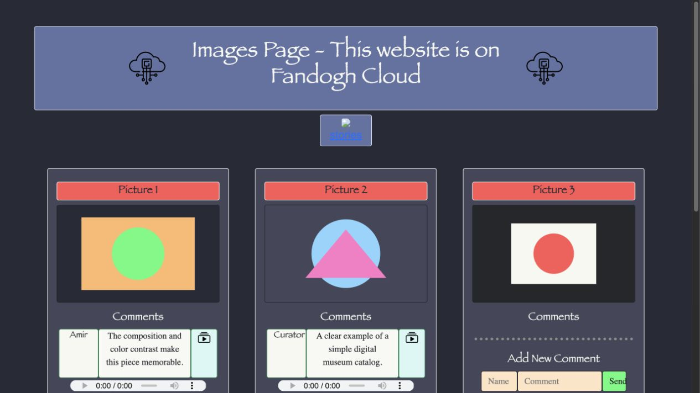
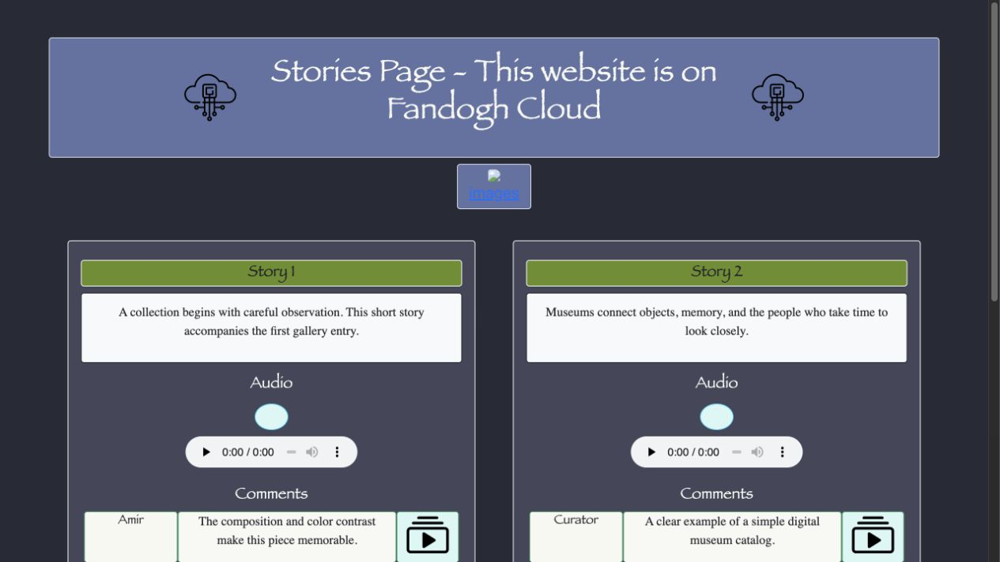
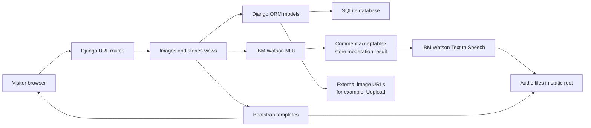

# Museum Stories — Django Cloud Application

A server-rendered Django museum platform for publishing image collections and short stories, collecting visitor comments, and enriching approved content with audio. The project combines Django models, admin workflows, Bootstrap templates, SQLite persistence, external image hosting, IBM Watson language analysis, and IBM Watson text-to-speech integration.

The application is a useful software-engineering example because it connects a browser UI, a relational data model, moderation logic, external APIs, static media, and a cloud deployment target in one small system.

## Local interface preview

These previews were rendered from the existing Django application using temporary local sample records. They show the actual template flow without changing the application code.





## Product capabilities

- **Image gallery:** Displays administrator-managed image records and their approved visitor comments.
- **Story collection:** Publishes text stories with associated audio and visitor discussion.
- **Comment workflow:** Receives a visitor name and comment, sends the text to IBM Watson Natural Language Understanding, and stores the moderation result.
- **Audio enrichment:** Generates audio for accepted comments through IBM Watson Text to Speech and exposes story/comment audio controls in the templates.
- **Django administration:** Registers the `Image`, `Storie`, and `Comment` models in the Django admin site.
- **Cloud-oriented architecture:** Uses external services for language analysis, speech synthesis, image hosting, and the historical PaaS deployment target.

## Architecture



### Request flow for a comment

1. A visitor submits a name and comment from `/images/` or `/stories/`.
2. The view calls `main_app.cloudServices.isCommentAcceptable()`.
3. The IBM Watson NLU response is used to decide whether the comment is displayed.
4. Accepted comments are sent to `textToAudio()` and the generated audio path is stored with the comment.
5. The comment is persisted in the `Comment` model and approved comments are rendered on the next page response.

The current implementation performs the external API calls synchronously inside the request. That is simple for a course project, but a production system should move moderation and speech generation to a background job so a slow provider does not block the web request.

## Data model

| Model | Purpose | Current representation |
| --- | --- | --- |
| `Image` | Gallery item | External image address plus a string image ID |
| `Storie` | Story entry and audio metadata | Story text, audio link, and string story ID |
| `Comment` | Visitor feedback | Author, text, moderation flag, target ID, audio link, and string comment ID |

The Django admin registers all three models, allowing content to be created and managed without editing templates.

## Routes

| URL | Behavior |
| --- | --- |
| `/` | Image gallery |
| `/images/` | Image gallery and comment submission endpoint |
| `/stories/` | Story collection and comment submission endpoint |
| `/admin/` | Django administration |

## Technology stack

- Python 3
- Django 3.2.7
- Bootstrap 5.1.1 via CDN
- SQLite for the default relational database
- IBM Watson Natural Language Understanding for comment analysis
- IBM Watson Text to Speech for comment audio
- Uupload-style external image hosting referenced by the original deployment
- Fandogh PaaS referenced as the historical cloud deployment target

## Quick start

The repository pins an older Django-era dependency set. A Python version compatible with Django 3.2.7 is recommended; the local verification for this documentation used Python 3.9.

```bash
python3 -m venv .venv
source .venv/bin/activate
python -m pip install --upgrade pip
python -m pip install -r requirements.txt
python manage.py migrate
python manage.py createsuperuser
python manage.py runserver
```

Open the application at `http://127.0.0.1:8000/` and the admin site at `http://127.0.0.1:8000/admin/`.

After signing in to the admin site, add `Image` and `Storie` records. `Image.imageAddress` currently expects an image URL, while story and comment audio paths refer to files under the configured static root. The repository does not include a seeded `db.sqlite3`, so content must be created locally or through a deployment data-loading step.

## Configuration and deployment

The project is configured as a traditional Django deployment with:

- `djangoProj.settings` as the settings module;
- `djangoProj.wsgi.application` as the WSGI entry point;
- `STATIC_ROOT` set to the repository's `statics/` directory;
- SQLite as the default database;
- explicit host allow-list entries for historical deployment hosts and localhost.

For a production deployment, add a deployment-specific settings layer and provide secrets through environment variables or a secret manager. Run migrations before starting the WSGI server and run `collectstatic` into a clean static artifact rather than treating the development static directory as an upload area.

## Security status and production hardening

Before deploying or sharing a live instance, address these items:

- `main_app/cloudServices.py` currently contains hard-coded IBM Watson IAM credentials and service URLs. Rotate those credentials immediately and move all secrets to environment variables or a managed secret store.
- `djangoProj/settings.py` contains a hard-coded `SECRET_KEY` and has `DEBUG = True`. Use a fresh secret key per environment and set `DEBUG = False` in production.
- Restrict `ALLOWED_HOSTS` and configure secure cookies, HTTPS, CSRF trusted origins, and security middleware settings for the deployment domain.
- Replace direct `request.POST[...]` access with Django Forms or ModelForms, validate lengths and identifiers, and return user-facing validation messages.
- Replace the broad exception handler in the NLU integration with explicit exception handling, structured logging, timeouts, and a documented fail-open/fail-closed moderation policy.
- The current model uses string IDs instead of relational foreign keys, so comments can reference missing content. A production schema should use `ForeignKey` relationships and database constraints.
- The local browser render returns 404 responses for the audio URLs because templates request `/static/...` while the committed audio files are under `STATIC_ROOT` (`statics/`). Configure Django static-file finders/URLs correctly, or move generated audio to a dedicated media storage path.
- The `download_file` helper is not routed and currently opens a directory path rather than a concrete audio file. Use Django's file response helpers with validated filenames if downloads are required.

These are documented as engineering boundaries because the repository is a course project; the documentation does not claim that the current configuration is production-safe.

## Testing and verification

The repository currently contains only the default empty Django test module. A stronger test suite should cover:

- anonymous GET requests to the image and story pages;
- valid, empty, oversized, and malformed comment submissions;
- moderation provider success, timeout, and failure behavior;
- audio-generation failures and static-file references;
- admin model registration and database relationships;
- template behavior for approved versus rejected comments.

The documentation update was verified with `python manage.py check` and local browser renders of both primary pages using Django 3.2.7. External IBM calls were not exercised because the credentials must not be used for documentation testing.

## Suggested GitHub metadata

**Recommended repository name:** `museum-content-platform-django`

**About description:** A Django museum content platform with admin-managed galleries, stories, visitor comments, Watson moderation, and text-to-speech audio.
